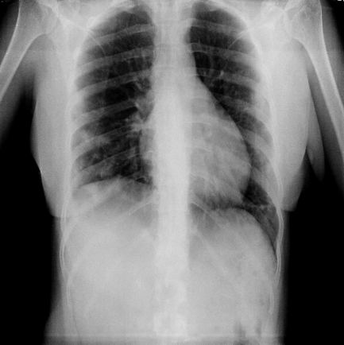

# Medical-Imaging-Analysis-for-chest-Radiographs

Medical imaging Analysis and classifying for possible predictions using Computer vision along with AI to aid for faster decision making for clinicians providing explanations for the predicted results using Explainable AI (XAI).

## 1-Lungs_Pathological_Condition_Diagnosis
Identifying pathological conditions present in the lungs and providing explainability using heatmaps.

## 2-covid_19_predictions_and_interpretation
- Identifying Covid-19 patterns and predicting from images and providing explainability with heatmaps.
- ViT Transformer was used for the analysis 

 
